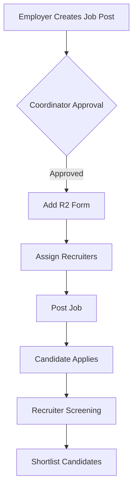

# 🚀 TalentFlow - MERN Stack Applicant Tracking System

[](https://react.dev/)
[](https://nodejs.org/)
[](https://www.mongodb.com/)
[](https://tailwindcss.com/)

A comprehensive Applicant Tracking System designed to streamline recruitment workflows with role-based access control and automated hiring pipelines.

## 🌟 Key Features

### 👥 Role-Based Access Control
- Four distinct user roles: Candidate, Employer, Coordinator, Recruiter
- Custom dashboards for each role
- JWT authentication with secure session management

### 📋 Hiring Workflow Management
- Multi-stage job posting approval system
- Customizable R1/R2 evaluation forms
- Candidate shortlisting pipeline
- Real-time application status tracking

### 📊 Interactive Dashboards
- Employer: Job post creation & analytics
- Coordinator: Workflow management & recruiter assignment
- Recruiter: Candidate evaluation & screening
- Candidate: Application tracking & status updates

## 🛠️ Tech Stack

### Frontend
[](https://redux.js.org/)
[](https://reactrouter.com/)

### Backend
[](https://expressjs.com/)
[](https://mongoosejs.com/)

## 📸 Application Screenshots

### Authentication
| Signup | Login |
|--------|-------|
|  |  |

### Employer View
| Dashboard | Job Creation |
|-----------|--------------|
|  |  |

### Coordinator View
| Main Dashboard | Recruiter Assignment |
|----------------|-----------------------|
|  |  |

### Recruiter View
| Dashboard | Evaluation Form |
|-----------|-----------------|
|  |  |

### Candidate View
| Job Listings | Application |
|--------------|-------------|
|  |  |

## 🚀 Installation Guide

```bash
# Clone repository
git clone https://github.com/Itsmesrinu/JOBAPPLICATIONS-TRACKING-SYSTEM.git
cd application-tracking-system

# Install server dependencies
cd server && npm install

# Install client dependencies
cd ../client && npm install
```

### Environment Setup
Create `.env` in `/server` with:
```env
MONGODB_URL=your_mongodb_connection_string
JWT_SECRET=your_jwt_secret_key
```

## ⚡ Running the System

1. **Start Backend**
```bash
cd server
npm run dev
```

2. **Start Frontend**
```bash
cd client
npm start
```

Access the system at `http://localhost:3000`

## 🔄 Workflow Diagram



## 📄 License
Distributed under
